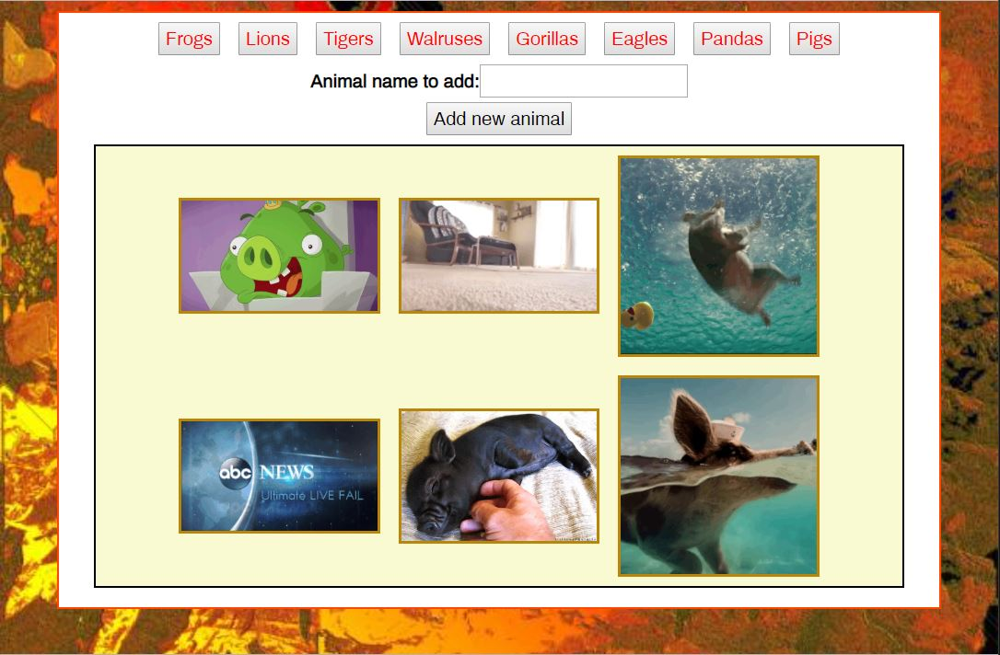

# GifTastic
Week 6 homework assignment
### Overview
This project focuses on creating a buttons driven interactive web page for displaying a collection of GIFs using AJAX, JQuery, Javascript, HTML and CSS.

### Purpose
The project taught us how to use AJAX to query a web service and return a collection of data that can in turn be presented on a web page.

### Assignment Description
This assignment created a web page that uses AJAX to query the GIFy web service. It provides the user with a collection of buttons. Each button is associated with a particular animal. When clicked, the button activates code to query the GIFy web site to return 10 GIFs and associated meta-data for the animal associated with the button that was clicked. The web page provides users with the means to enter new animals with associated buttons.

This project is maintained by Peter Tag

